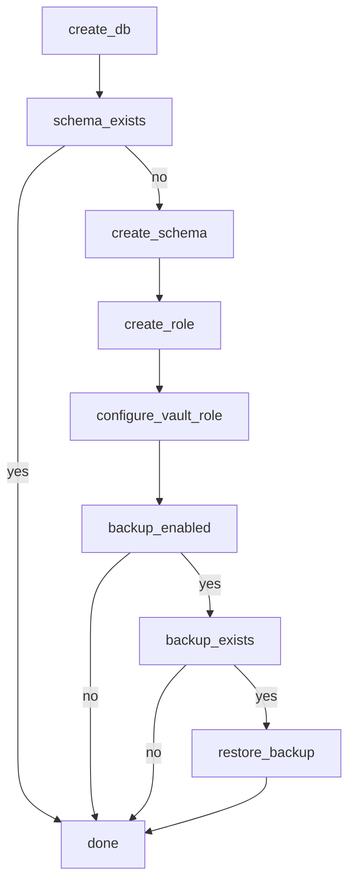

# Postgres Operator (for Nomad)


## Goals

- simple usage
- automated backup and restore
- few configuration options
- credentials are written to vault
- vault integration with the `database/PostgreSQL` backend

## Use case

Nomad job which specifies some minimal metadata:

```c
job "docs" {
  meta {
    "database.enabled" = true
    "database.backup" = true
  }
}
```

Would cause a database to be created, and after creation configure Vault, and if there is a backup, restore that.

## Design



- start with a cli or script
- leave backup and restore for vNext
- create a reader, writer, deployer roles in vault


## Tasks

- [ ] docker-compose with Postgres, Vault, Grafana (OTEL)
- [ ] shell script to create a database
- [ ] expand script to configure vault
