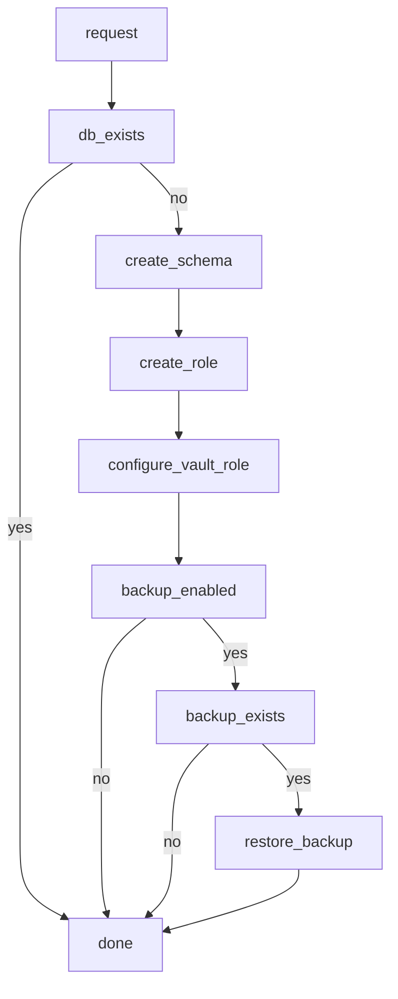

# Postgres Operator (for Nomad)


## Goals

- simple usage
- automated backup and restore
- few configuration options
- credentials are written to vault
- vault integration with the `database/PostgreSQL` backend
- database per app, rather than schema per app

## Use case

Nomad job which specifies some minimal metadata:

```c
job "docs" {
  meta {
    "database.enabled" = true
    "database.backup" = true
  }
}
```

Would cause a database to be created, and after creation configure Vault, and if there is a backup, restore that.

## Design



- start with a cli or script
- leave backup and restore for vNext
- create a reader, writer, deployer roles in vault

## Tasks

- [x] docker-compose with Postgres, Vault, Grafana (OTEL)
- [x] shell script to create a database
- [x] expand script to configure vault

## Dev


Environment prep:

1. Run `docker compose up -d`
2. Run nomad with `nomad agent -dev-vault` to connect to the vault container
3. Run `./configure-vault.sh` to allow nomad <-> vault communication


Operator installation:

1. configure Vault authentication:
  - set `VAULT_ADDR` and either set `VAULT_TOKEN` or run `vault login`
2. configure postgres authentication:
  - set `PGHOST`
  - set `PGUSER` and `PGPASSWORD`
3. Run `./configure-operator.sh "jwt-nomad"` to install the operator parts
4. Run the operator `nomad job run pg-operator.nomad`

Testing:

1. Install a job `nomad job run example.nomad`
